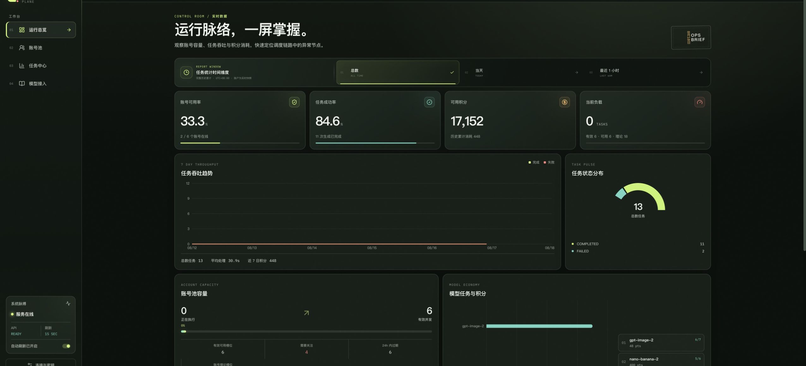
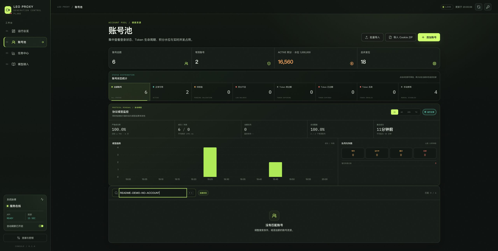
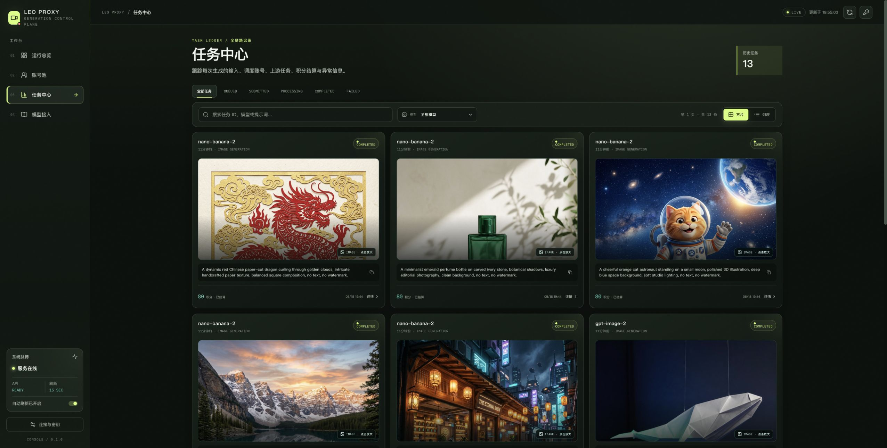
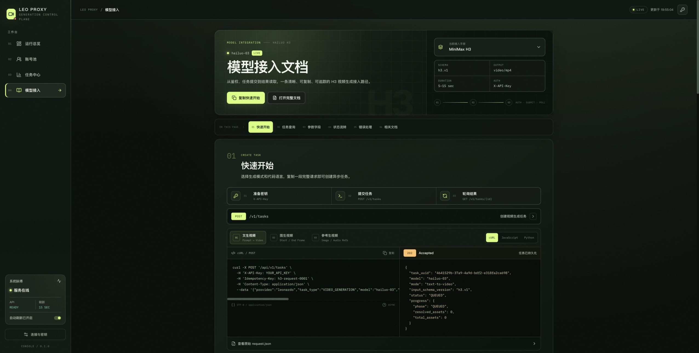

# LEO Proxy

> 🔥 Leonardo 视频生成 API 网关：Token 池自动调度 + JWT 自动保活 + OpenAI 风格接口，支持 Seedance 2.0 / Sora 2 / Kling O3 / MiniMax H3

## About

LEO Proxy 是面向 Leonardo 上游的 Web/API 图片与视频任务控制台，提供统一的任务提交、状态轮询、账号调度、积分结算和媒体结果管理能力。核心关键词：

- Leonardo 视频生成 API 网关
- Token 池自动调度与 JWT 自动保活
- OpenAI 风格的任务接口
- Seedance 2.0、Sora 2、Kling O3、MiniMax H3

项目提供 Web 页面和 API 服务，不包含桌面客户端。`worker`、`syncer` 和 `migrate` 是 API
的后台组件，MySQL 是运行依赖。

交流群：[加入 Telegram 交流群](https://t.me/+x3r78uCRo5lmOTU9)

## 页面预览

### 运行总览

查看账号可用率、任务成功率、积分、负载、吞吐趋势和模型消耗。



### 账号池

管理账号状态、积分、并发、Token 和协议续签，支持批量导入及 Cookie ZIP 导入。截图使用
无匹配结果的演示筛选，未展示账号邮箱或凭据。



### 任务中心

按状态和模型查询任务，查看提示词、生成媒体、积分结算和错误信息。



### 模型接入

提供鉴权、提交、轮询、参数和错误处理示例。



### 真实生成案例

以下案例由 `nano-banana-2` 通过真实 Leonardo 上游生成，并在任务中心打开图片预览。


## 项目结构

```text
leo_proxy/
├── api/                 FastAPI、Worker、Syncer、Alembic 和测试
├── web/                 React/Vite 控制台与 Nginx 配置
├── docs/                架构、运维、测试报告和页面截图
├── compose.yaml         本地完整运行环境
└── README.md
```

## 环境要求

- Docker 与 Docker Compose
- Node.js 20 或更高版本
- npm
- 使用真实上游时，运行环境需要能访问 Leonardo

Python 3.12 和后端依赖由 API Docker 镜像安装，本地无需单独创建 Python 环境。

## 安装与启动

进入项目目录：

```bash
cd /path/to/mul_key_chrome-leo/leo_proxy
```

安装 Web 依赖并生成生产静态文件：

```bash
npm --prefix web ci
npm --prefix web run build
```

检查 Compose 配置并启动全部组件：

```bash
docker compose config --quiet
docker compose up -d --build
docker compose ps
```

默认访问地址：

| 服务 | 地址 | 本地默认凭据 |
|---|---|---|
| Web 控制台 | <http://127.0.0.1:28081> | `admin / leo-proxy-local` |
| API | <http://127.0.0.1:28080> | 请求头 `X-API-Key: leo-proxy-api-key` |
| API Ready | <http://127.0.0.1:28080/health/ready> | 无 |
| MySQL | `127.0.0.1:23306` | 仅供本地 Compose 使用 |

健康检查：

```bash
curl -fsS http://127.0.0.1:28080/health/ready
curl -u 'admin:leo-proxy-local' -fsS \
  http://127.0.0.1:28081/console-health
```

预期分别返回 `{"status":"ready"}` 和 `ok`。

## 配置

可在 `leo_proxy/.env` 中覆盖本地默认配置；该文件已被 Git 忽略。

```dotenv
LEO_PROXY_API_KEY=replace-with-api-key
LEO_PROXY_ADMIN_KEY=replace-with-admin-key
LEO_PROXY_CONSOLE_USER=admin
LEO_PROXY_CONSOLE_PASSWORD=replace-with-console-password
LEO_PROXY_MYSQL_ROOT_PASSWORD=replace-with-mysql-root-password
LEO_PROXY_CREDENTIAL_MASTER_KEY=replace-with-32-byte-base64-key
LEO_PROXY_UPSTREAM_MODE=leonardo
LEO_PROXY_LEONARDO_SCHEMA_VERSION=latest
```

生成新的凭据加密主密钥：

```bash
openssl rand -base64 32
```

常用端口变量：

| 变量 | 默认值 | 说明 |
|---|---:|---|
| `LEO_PROXY_WEB_PORT` | `28081` | Web 对外端口 |
| `LEO_PROXY_API_PORT` | `28080` | API 对外端口 |
| `LEO_PROXY_MYSQL_PORT` | `23306` | MySQL 本地映射端口 |

默认 `LEO_PROXY_UPSTREAM_MODE=leonardo`，会提交真实任务并消耗账号积分。只测试任务生命周期时可使用：

```bash
LEO_PROXY_UPSTREAM_MODE=mock docker compose up -d --build
```

## 使用方法

### 1. 导入账号

1. 登录 Web 控制台并进入“账号池”。
2. 单个账号使用“添加账号”；账本批次使用“批量导入”。
3. Leonardo 浏览器会话使用“导入 Cookie ZIP”，选择 ZIP 后等待批次进入 `COMPLETED`。
4. 确认账号状态为 `ACTIVE`、积分已同步且协议续签可用。

Cookie、Token、邮箱和密码不得写入 README、测试报告或 Git。

### 2. 提交 GPT Image 2 图片任务

```bash
curl -fsS -X POST http://127.0.0.1:28080/v1/tasks \
  -H 'Content-Type: application/json' \
  -H 'X-API-Key: leo-proxy-api-key' \
  -H 'Idempotency-Key: readme-gpt-image-2-0001' \
  --data '{
    "provider": "leonardo",
    "task_type": "IMAGE_GENERATION",
    "model": "gpt-image-2",
    "mode": "text-to-image",
    "input": {
      "prompt": "A premium studio product photograph, clean background, no text",
      "quality": "LOW",
      "aspect_ratio": "1:1",
      "size": "SMALL",
      "resolution": "1024x1024"
    },
    "estimated_credit_cost": 8
  }'
```

### 3. 提交 Nano Banana 2 图片任务

```bash
curl -fsS -X POST http://127.0.0.1:28080/v1/tasks \
  -H 'Content-Type: application/json' \
  -H 'X-API-Key: leo-proxy-api-key' \
  -H 'Idempotency-Key: readme-nano-banana-2-0001' \
  --data '{
    "provider": "leonardo",
    "task_type": "IMAGE_GENERATION",
    "model": "nano-banana-2",
    "mode": "text-to-image",
    "input": {
      "prompt": "A detailed paper-cut dragon, balanced composition, no text",
      "aspect_ratio": "1:1",
      "size": "SMALL",
      "resolution": "1024x1024"
    },
    "estimated_credit_cost": 80
  }'
```

每次请求必须使用新的 `Idempotency-Key`。接口返回 `task_uuid` 后可查询任务：

```bash
TASK_UUID='替换为返回的任务 UUID'
curl -fsS \
  -H 'X-API-Key: leo-proxy-api-key' \
  "http://127.0.0.1:28080/v1/tasks/${TASK_UUID}"
```

终态为 `COMPLETED` 或 `FAILED`。成功任务的 `output.media` 包含生成文件地址、媒体类型和尺寸，
也可以在“任务中心”直接查看或放大图片。

## 测试

```bash
docker compose run --rm api pytest -q
docker compose run --rm api ruff check src tests scripts
npm --prefix web test -- --run
npm --prefix web run build
npm --prefix web audit --omit=dev
```

最近一次本地验证结果：API `1199 passed`、Web `42 passed`、生产依赖审计 0 漏洞；详见
[测试报告](docs/test-report-2026-08-18.md)。

## 日常运维

查看运行状态和日志：

```bash
docker compose ps
docker compose logs --tail=200 api worker syncer web
```

重新构建并更新服务：

```bash
npm --prefix web run build
docker compose up -d --build
```

停止服务但保留 MySQL 数据卷：

```bash
docker compose down
```

不要在日常停止时添加 `-v`；删除数据卷会永久移除账号和任务历史。

## 相关文档

- [架构说明](docs/architecture.md)
- [本地运行与运维说明](docs/operations.md)
- [2026-08-18 测试报告](docs/test-report-2026-08-18.md)

当前 README 面向本地安装与验收。生产部署前必须替换所有默认密钥和密码，并单独确定正式域名、TLS、公开端口、部署路径及备份策略。

## 许可证

[MIT License](LICENSE)
