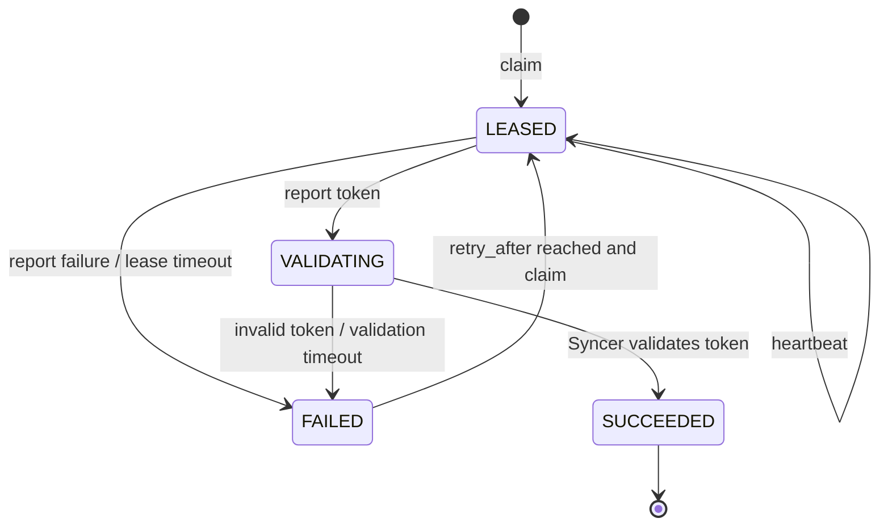

# 账号登录作业 API

本接口把账号密码登录与 Token 校验拆成异步流水线。作业机器只负责领取账号、完成登录并上报
新 Token；API 保存租约，Syncer 使用现有上游校验逻辑更新余额与最终账号状态。

## 调度规则

1. 有效期小于等于 10 分钟且保存了续签会话的账号，先进入云端协议续签门闩。Syncer 调用
   `GET /api/auth/get-session`，成功后直接更新 Token；接口失败、会话失效或 420 秒窗口耗尽后
   才允许 claim 返回 `RENEW_TOKEN`。请求使用 Chrome 136 TLS 指纹，默认并发 3、起始间隔 2 秒；
   429 遵守 `Retry-After`，缺失时冷却 300 秒。没有续签会话的账号直接进入原登录续约路径。
2. 客户端会话真实上报时间达到 80 分钟时，claim 提前返回 `REFRESH_SESSION`。桌面端重新登录并
   上报新 Token、Cookie、客户端版本和 `better-auth-v1` 能力，陈旧会话不进入第二轮协议续签。
3. `ACTIVATE_NEW` 按积分水位补水：只对状态严格等于 `ACTIVE` 的账号求
   `SUM(balance_credits)`。结果低于 `1000000` 时，从无 Token 的 `PENDING_VALIDATION` 账号中
   最多保持 3 个 `LEASED`/`VALIDATING` 激活作业，并优先选择失败次数更少、最久未尝试的账号。
4. `reserved_credits`、运行任务数、Token 有效期和其他账号状态不进入水位求和；旧版 Desktop
   使用的闲置账号数量继续随响应返回，但不再控制首次激活。
5. 已知低积分账号不参与任何领取；新导入账号的 `balance_synced_at=NULL` 表示余额未知，
   可以在池容量不足时做首次登录。
6. claim 事务先锁定 `login_pool_policy(id=1)`，再使用 `FOR UPDATE SKIP LOCKED` 选择账号；
   `active_account_id` 唯一约束保证一个账号同时最多存在一个活动登录作业。
7. 普通账号错误累计 5 次、`TIMEOUT`/`LOGIN_STALLED`/校验超时累计 3 次后进入
   `MANUAL_DISABLED` 隔离且停止自动重试。不可重试错误立即隔离。`ENOSPC`、服务不可达、租约丢失
   等执行器/基础设施错误不计入账号失败次数，只进入 300 秒退避。

## 鉴权与敏感字段

所有路径使用独立请求头：

```text
X-Login-Worker-Key: WORKER_API_KEY
```

claim 响应中的 `password` 与 `lease_token` 只在本次响应出现，所有响应带
`Cache-Control: no-store`。数据库只保存账号密码、Token、浏览器续签会话的 AES-GCM 密文与
租约 Token 的 SHA-256，日志不记录这些字段。每个回调还必须同时匹配 `worker_id` 和
`lease_token`。

## 1. 领取作业

```bash
curl -sS -X POST 'https://api-leo.clawsea.ai/internal/v1/account-login-jobs/claim' \
  -H 'X-Login-Worker-Key: WORKER_API_KEY' \
  -H 'Content-Type: application/json' \
  -d '{"worker_id":"login-worker-01","limit":5}'
```

示例响应：

```json
{
  "jobs": [
    {
      "job_uuid": "JOB_UUID",
      "job_type": "RENEW_TOKEN",
      "account_uuid": "ACCOUNT_UUID",
      "login_name": "ACCOUNT_LOGIN",
      "password": "ACCOUNT_PASSWORD",
      "previous_token_expires_at": "2026-08-08T08:10:00",
      "lease_token": "LEASE_TOKEN",
      "lease_expires_at": "2026-08-08T08:05:00"
    }
  ],
  "pool": {
    "watermark_mode": "ACTIVE_CREDIT_SUM",
    "credit_target": 1000000,
    "active_credit_total": 999999,
    "credit_deficit": 1,
    "below_watermark": true,
    "activation_in_flight": 1,
    "idle_target": 100,
    "available_idle": 100,
    "in_flight_idle": 1,
    "effective_idle": 101,
    "activation_budget_before_claim": 0,
    "renewal_claimed": 1,
    "activation_claimed": 0,
    "new_account_dispatch_suppressed": true
  }
}
```

空队列返回 `200` 和 `jobs: []`，作业机器按自身退避周期再次拉取。

### Worker 鉴权预检

桌面端设置页使用只读接口验证 Worker Key，不会领取账号或创建租约：

```bash
curl -sS 'https://api-leo.clawsea.ai/internal/v1/account-login-jobs/worker-status' \
  -H 'X-Login-Worker-Key: WORKER_API_KEY'
```

响应包含 `watermark_mode=ACTIVE_CREDIT_SUM`、积分目标、兼容闲置目标、续约窗口、租约秒数和
单次最大领取数，并带 `Cache-Control: no-store`。

## 2. 心跳续租

默认租约为 300 秒。登录流程预计超过租约时调用：

```bash
curl -sS -X POST \
  'https://api-leo.clawsea.ai/internal/v1/account-login-jobs/JOB_UUID/heartbeat' \
  -H 'X-Login-Worker-Key: WORKER_API_KEY' \
  -H 'Content-Type: application/json' \
  -d '{"worker_id":"login-worker-01","lease_token":"LEASE_TOKEN"}'
```

过期租约不会续期，返回 `LOGIN_JOB_LEASE_EXPIRED`；重新 claim 获取新作业。

## 3. 上报 Token

```bash
curl -sS -X POST \
  'https://api-leo.clawsea.ai/internal/v1/account-login-jobs/JOB_UUID/token' \
  -H 'X-Login-Worker-Key: WORKER_API_KEY' \
  -H 'Content-Type: application/json' \
  -d '{
    "worker_id":"login-worker-01",
    "lease_token":"LEASE_TOKEN",
    "video_token":"NEW_TOKEN",
    "token_expires_at":"2026-08-08T10:00:00Z",
    "balance_credits":500,
    "renewal_session": {
      "cookies": [{
        "name":"__Secure-better-auth.session_data.0",
        "value":"SESSION_COOKIE",
        "domain":"app.leonardo.ai",
        "path":"/"
      }],
      "user_agent":"BROWSER_USER_AGENT",
      "accept_language":"zh-CN,zh;q=0.9",
      "client_version":"7.0.8",
      "capability":"better-auth-v1"
    }
  }'
```

成功接收返回 HTTP `202`、作业状态 `VALIDATING`。API 加密保存 Token，把账号置为
`PENDING_VALIDATION`；Syncer 随后校验 Token 和余额：

- Token 有效：作业 `SUCCEEDED`，账号按余额与有效期进入 `ACTIVE`、
  `LOW_BALANCE_DISABLED` 或 `TOKEN_EXPIRING`。
- Token 无效：作业 `FAILED`，账号进入 `TOKEN_EXPIRED` 并按指数退避后允许重试。

上报 Token 的有效期必须超过当前时间加 10 分钟，否则返回
`LOGIN_JOB_TOKEN_EXPIRY_TOO_SOON`。同一作业、同一 Token 的重复上报是幂等的；不同 Token
重复上报返回冲突，避免覆盖已经进入校验的凭据。

`renewal_session` 为可选字段。桌面登录 Worker 会随新 Token 上报最新 Leonardo Cookie、
User-Agent 和语言；API 校验 Cookie 域名并加密保存。后续 Token 进入 10 分钟窗口时，Syncer
优先使用这些材料完成协议续签。账号身份不匹配、会话未授权和重试窗口耗尽会进入登录兜底。
达到 `VIDEO_SERVICE_PROTOCOL_RENEWAL_CLIENT_SESSION_MAX_AGE_SECONDS` 后，服务器先下发
`REFRESH_SESSION` 轮换会话；客户端未携带 `renewal_session` 时清理旧服务端副本。
Better Auth 返回旋转 Cookie 但暂未返回 JWT 时，Syncer 会保留同一请求会话中的轮换结果并再
请求一次；全程不把 Cookie、Token 或响应正文写入日志。

查询结果：

```bash
curl -sS \
  'https://api-leo.clawsea.ai/internal/v1/account-login-jobs/JOB_UUID?worker_id=login-worker-01' \
  -H 'X-Login-Worker-Key: WORKER_API_KEY'
```

## 4. 上报失败

```bash
curl -sS -X POST \
  'https://api-leo.clawsea.ai/internal/v1/account-login-jobs/JOB_UUID/fail' \
  -H 'X-Login-Worker-Key: WORKER_API_KEY' \
  -H 'Content-Type: application/json' \
  -d '{
    "worker_id":"login-worker-01",
    "lease_token":"LEASE_TOKEN",
    "error_code":"LOGIN_REJECTED",
    "error_message":"provider rejected the login",
    "retryable":true
  }'
```

可重试失败从 60 秒开始指数退避，最大 1800 秒；不可重试失败默认冷却 86400 秒。

## 状态机



## 配置

| 环境变量 | 默认值 | 说明 |
| --- | ---: | --- |
| `VIDEO_SERVICE_LOGIN_WORKER_AUTH_KEY` | 本地示例值 | 登录机器独立 API Key |
| `VIDEO_SERVICE_LOGIN_ACTIVE_CREDIT_TARGET` | `1000000` | ACTIVE 账号总积分补水目标 |
| `VIDEO_SERVICE_LOGIN_IDLE_TARGET` | `20` | 兼容旧版 Desktop 的展示字段，不再参与补水判定 |
| `VIDEO_SERVICE_LOGIN_RENEWAL_WINDOW_SECONDS` | `600` | 提前续约窗口 |
| `VIDEO_SERVICE_LOGIN_JOB_LEASE_SECONDS` | `300` | 单次租约时长 |
| `VIDEO_SERVICE_LOGIN_JOB_MAX_BATCH_SIZE` | `20` | 单次 claim 上限 |
| `VIDEO_SERVICE_LOGIN_JOB_RETRY_BASE_SECONDS` | `60` | 可重试失败初始退避 |
| `VIDEO_SERVICE_LOGIN_JOB_NONRETRYABLE_RETRY_SECONDS` | `86400` | 不可重试冷却 |
| `VIDEO_SERVICE_LOGIN_VALIDATION_TIMEOUT_SECONDS` | `300` | Token 校验超时 |
| `VIDEO_SERVICE_LOGIN_ACTIVATION_MAX_IN_FLIGHT` | `3` | 水位不足时允许的激活在途上限 |
| `VIDEO_SERVICE_LOGIN_JOB_MAX_ACCOUNT_FAILURES` | `5` | 普通账号错误隔离阈值 |
| `VIDEO_SERVICE_LOGIN_JOB_STALLED_MAX_ACCOUNT_FAILURES` | `3` | 卡滞/超时错误隔离阈值 |
| `VIDEO_SERVICE_LOGIN_JOB_WORKER_BACKOFF_SECONDS` | `300` | 执行器故障退避时间 |
| `VIDEO_SERVICE_PROTOCOL_RENEWAL_CLIENT_SESSION_MAX_AGE_SECONDS` | `4800` | 客户端会话主动轮换阈值 |
